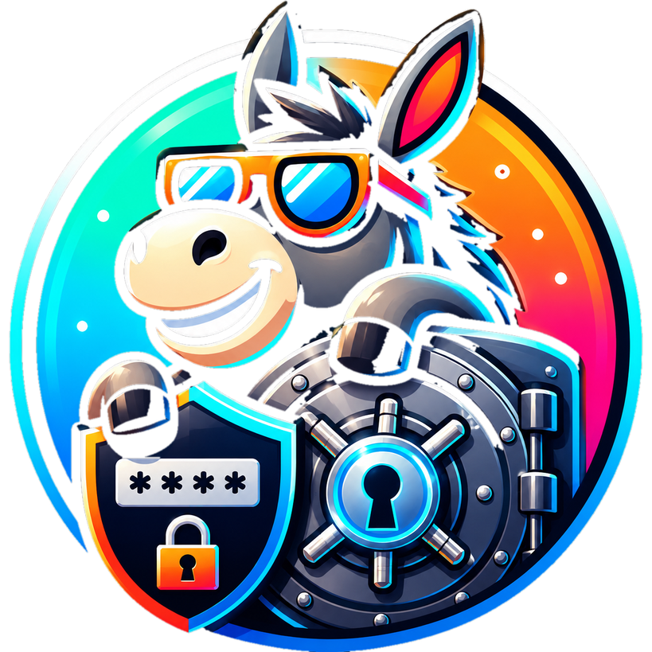

<p align="center">
  
</p>

<h1 align="center">DonkeyWork Vault</h1>

A **credential vault for humans and agents**. It stores API keys and OAuth tokens encrypted at
rest, records *how each credential is used*, and hands them out on demand — through a web console,
a REST API, and a single-binary CLI (`dwvault`).

It's offered two ways:

- **Hosted** at **[vault.donkeywork.dev](https://vault.donkeywork.dev)** — nothing to run. Log in,
  add credentials, mint an access key, and point the CLI at it. This is the default.
- **Self-hosted** — it's a single container + Postgres, so you can run the whole thing yourself if
  you'd rather hold the keys. See [Self-hosting](#self-hosting).

The design goal is **agent-friendly credential discovery**: a credential isn't an opaque secret,
it's *self-describing* (name, description, base URL, docs link, auth scheme, header, prefix). An
automated caller can list what exists, learn how to apply each one, and fetch the secret only at the
moment of use — without it ever being printed.

**Install the CLI** (Linux / macOS):

```bash
curl -fsSL https://raw.githubusercontent.com/andyjmorgan/DonkeyWork-Vault/main/install.sh | sh
```

Then `dwvault auth login` and you're set — full [Quick start](#quick-start) below.

---

## Contents

- [What it does](#what-it-does)
- [Quick start](#quick-start)
- [Install the CLI](#install-the-cli)
- [CLI reference](#cli-reference)
- [Credential model](#credential-model)
- [Access keys & scopes](#access-keys--scopes)
- [The web console](#the-web-console)
- [Security model](#security-model)
- [Self-hosting](#self-hosting)
- [Repository layout](#repository-layout)
- [Build & develop](#build--develop)

---

## What it does

- **Stores API keys** as self-describing credentials — each carries the secret plus the metadata a
  caller needs to *use* it: base URL, docs link, the header to send, an optional value prefix
  (`Bearer `), or HTTP Basic (`--username`).
- **Manages OAuth** for Google, Microsoft, GitHub and any custom OIDC provider. You connect once in
  the browser; the vault stores the tokens encrypted and **auto-refreshes** them, so the CLI always
  hands you a live access token.
- **Hands credentials to scripts and agents** over a small REST API and the `dwvault` CLI, with
  **secret-to-stdout discipline** so values flow through `$(...)` and never get echoed.
- **Encrypts everything at rest** with per-secret envelope encryption (AES-256-GCM); the database
  only ever holds ciphertext.
- **Authenticates machines with scoped, revocable access keys** (`dwv_…`) and humans with your own
  OIDC identity provider.
- **Audits every access** — who/what read which credential, when.

## Quick start

Using the hosted vault:

1. **Sign in** at [vault.donkeywork.dev](https://vault.donkeywork.dev) and add a credential (or
   connect an OAuth provider).
2. **Mint an access key** — *Profile & API keys* (top-right menu) → create a key with scope
   `vault:read`. The secret (`dwv_…`) is shown **once**; copy it.
3. **Install the CLI** and log in:

   ```bash
   curl -fsSL https://raw.githubusercontent.com/andyjmorgan/DonkeyWork-Vault/main/install.sh | sh
   dwvault auth login          # paste the dwv_… key
   ```

4. **Use it:**

   ```bash
   dwvault credentials list                          # what's stored + how to use each
   curl -H "Authorization: Bearer $(dwvault credentials get grafana)" https://grafana.example/api/health
   TOKEN=$(dwvault oauth token microsoft)            # live, auto-refreshed OAuth token
   ```

The CLI defaults to the hosted vault (`https://vault.donkeywork.dev`). Point it elsewhere with
`--addr` or `VAULT_ADDR` if you self-host.

## Install the CLI

One line — downloads the right prebuilt binary for your platform from the latest release, verifies
its checksum, and installs it:

```bash
curl -fsSL https://raw.githubusercontent.com/andyjmorgan/DonkeyWork-Vault/main/install.sh | sh
```

The installer honors a few env overrides:

| Variable | Default | Purpose |
|---|---|---|
| `DWVAULT_VERSION` | `latest` | install a specific release tag (e.g. `v0.4.0`) |
| `DWVAULT_BIN_DIR` | `~/.local/bin` (or `/usr/local/bin` if writable & on `PATH`) | install location |
| `DWVAULT_NO_VERIFY` | unset | set `1` to skip checksum verification |

Prebuilt binaries are published on every release for **linux** and **darwin**, `amd64` and `arm64`.
Prefer to do it by hand?

```bash
os=$(uname -s | tr '[:upper:]' '[:lower:]')
arch=$(uname -m); case "$arch" in x86_64|amd64) arch=amd64;; aarch64|arm64) arch=arm64;; esac
curl -fsSL -o dwvault \
  "https://github.com/andyjmorgan/DonkeyWork-Vault/releases/latest/download/dwvault-$os-$arch"
chmod +x dwvault && install -Dm755 dwvault ~/.local/bin/dwvault
dwvault --version
```

> **macOS:** the binaries aren't notarized yet, so a *browser* download is Gatekeeper-quarantined.
> The installer (and the `curl` line above) avoid that; if needed, `xattr -d com.apple.quarantine dwvault`.

## CLI reference

`dwvault` talks to the vault's REST API and authenticates with a `dwv_…` access key. Run
`dwvault auth login` once to store the key (OS keyring, or a `0600` file when no keyring is
available); thereafter every command uses it.

**Global flags** (each has an env equivalent):

| Flag | Env | Default | Meaning |
|---|---|---|---|
| `--addr` | `VAULT_ADDR` | `https://vault.donkeywork.dev` | vault address (`https://host[:port]` or bare `host:port`) |
| `--api-key` | `VAULT_API_KEY` | — | access key (`dwv_…`); overrides the stored login for this call |
| `--tls` | `VAULT_TLS` | off | force TLS for a bare `host:port` (implied by an `https://` addr) |
| `--user` | `VAULT_USER_ID` | — | caller user id (self-host / trusted-network only) |
| `--tenant` | `VAULT_TENANT_ID` | — | caller tenant id |

**Commands:**

```bash
# auth — manage the stored key for a host (validated against /api/v1/me)
dwvault auth login [--force]       # paste & store a dwv_… key
dwvault auth status                # which credential is active for --addr
dwvault auth logout                # forget the stored key

# credentials — your self-describing API-key credentials  (alias: creds)
dwvault credentials list                 # name + description + header/prefix/base-url/docs
dwvault credentials get    <name>        # the secret to stdout (for $(...) substitution)
dwvault credentials header <name>        # ready "Header: value" line, e.g. for curl -H
dwvault credentials shape  <name>        # JSON: scheme/username/base_url/header/prefix/docs_url
dwvault credentials create <name> --secret <v> \
        [--description ..] [--base-url ..] [--docs ..] \
        [--header Authorization] [--prefix 'Bearer '] \
        [--username <u>]                 # --username ⇒ HTTP Basic (secret is the password)

# oauth — live access tokens (auto-refreshed)
dwvault oauth list                       # connected providers (provider/account/expiry/scopes)
dwvault oauth token <provider> [--account <a>]   # a valid access token to stdout

# keys — scoped access keys for scripts/agents
dwvault keys list                        # id/name/scopes/enabled/prefix/last-used
dwvault keys create <name> --scope vault:read [--scope ..] [--description ..]   # secret → stdout, ONCE
dwvault keys enable  <id>
dwvault keys disable <id>                # revoke without deleting
dwvault keys delete  <id>
```

**Workflow: discover → interpret → use.** Read `credentials list` / `shape` to learn the header,
prefix and base URL a credential needs, then `get` (or `header`) it only at call time:

```bash
# Build the call from the credential's own shape — secret never printed:
curl -H "$(dwvault credentials header grafana)" https://grafana.example.com/api/health

# OAuth (auto-refreshed) access token:
TOKEN=$(dwvault oauth token microsoft) && \
  curl -H "Authorization: Bearer $TOKEN" https://graph.microsoft.com/v1.0/me
```

> **Never echo the value.** Use it via `$(...)` or an env var; don't `echo` it, put it in a visible
> command argument, a URL query, `curl -v`, or any committed/printed text. Confirm success by a side
> effect (e.g. HTTP 200), not by printing the secret.

## Credential model

- **API keys are free-form and self-describing** — `name`, `description`, `base_url`, `docs_url`,
  and an auth shape: either a **header** key (sent as `<header>: <prefix><secret>`, default header
  `Authorization`) or **HTTP Basic** (`--username`, secret is the password →
  `Authorization: Basic base64(user:secret)`). There's no fixed "provider type"; the metadata is
  what tells a caller how to use the key.
- **OAuth** — built-in manifests for Google / Microsoft / GitHub plus custom OIDC providers (added by
  pasting an issuer URL — endpoints are discovered from `.well-known/openid-configuration`). Per-user
  app configs (client id/secret) and tokens are envelope-encrypted; tokens are **auto-refreshed** on
  retrieval.

## Access keys & scopes

Scripts and agents authenticate with a database-backed **access key** (`dwv_…`) sent as
`X-Api-Key: dwv_…` (or `Authorization: Bearer dwv_…`). Keys are **show-once**: only a SHA-256 hash
and a display prefix are stored, so a database dump never yields a usable key — a lost key is
**rotated, not recovered**. Disable a key to revoke it instantly without deleting it.

| Scope | Grants |
|---|---|
| `vault:read` | read RPCs — get a credential / OAuth token, describe, list |
| `vault:readwrite` | the above **plus** create / delete / upsert (implies `vault:read`) |
| `vault:audit` | read the audit log |

Mint keys from the web console (**Profile & API keys**) or with `dwvault keys create`:

```bash
export VAULT_API_KEY=$(dwvault keys create agent-bot --scope vault:read)
dwvault credentials get grafana          # works (vault:read)
dwvault credentials create x --secret y  # denied (needs vault:readwrite)
```

> **Wiring up an agent?** [`examples/skills/credential-manager/`](examples/skills/credential-manager/SKILL.md)
> is a ready-to-use Claude Code skill that drives the CLI (discover → `shape` → use) with the
> secret-handling guardrails baked in. Copy it into your agent's skills directory.

## The web console

The vault serves a React console (the same origin as the API) where you:

- **Credentials** — add/edit/delete self-describing API keys; reveal a stored secret or a live OAuth
  access token on demand.
- **OAuth Connect** — enter your OAuth app's client id/secret, pick scopes from a described catalog,
  and connect via browser redirect; see connected accounts.
- **Providers** — add custom OAuth providers via OIDC discovery (paste an issuer URL); built-ins are
  read-only.
- **Profile & API keys** — your user/tenant id, and where you create, scope, enable/disable and
  delete access keys. The full key value is shown once, on creation.

On the **hosted** vault, login is handled for you. **Self-hosted**, you bring your own OIDC identity
provider (see below).

## Security model

- **Envelope encryption.** Each secret gets a per-row data key (DEK); the value is sealed with
  **AES-256-GCM**, and the DEK is wrapped by a key-encryption key (KEK). The stored blob is
  self-describing (`magic | version | kekId | wrappedDek | nonce | tag | ciphertext`) so KEKs can be
  rotated — add a new `ActiveKekId` and keep the old one to decrypt historical rows.
- **The database only ever holds ciphertext.** Decryption happens in the vault process.
- **Secret-to-stdout discipline.** The CLI prints a secret to **stdout only**, with no decoration,
  so it's safe for `$(...)` and never needs echoing. Logs and errors go to stderr.
- **Auth.** Machines use scoped, revocable access keys (`dwv_…`); the vault resolves the key, owns
  the identity, and enforces the required `vault:*` scope on every endpoint. Humans use standard OIDC
  bearer JWTs from your IdP. OAuth connect uses authorization-code flow with **PKCE (S256)**.
- **Audit.** Every credential access is recorded (key reference, never the secret) and queryable with
  `vault:audit`.

## Self-hosting

The whole product is **one container** — REST API + OAuth + the React console — plus Postgres. It
serves HTTP on **:8080** (health at **/healthz**) and runs EF Core migrations on start.

Build/run with `Dockerfile.vault`. Provide via configuration:

| Setting | Meaning |
|---|---|
| `Vault:Persistence:ConnectionString` | Postgres connection string. |
| `Vault:Crypto:ActiveKekId` | id of the KEK used to wrap new secrets. |
| `Vault:Crypto:Keks:<id>` | base64-encoded 256-bit (32-byte) key material; keep every historical id to decrypt old rows. |
| `Vault:PublicBaseUrl` | public origin, used to build OAuth redirect URIs. |
| `Vault:RunMigrationsOnStartup` | defaults `true`. |
| `Oidc:Authority` | your issuer URL (the SPA logs in against it; the API validates the token issuer via JWKS). Leave **blank to disable auth** — local/dev only. |
| `Oidc:ClientId` / `Oidc:Audience` | SPA client id / expected audience (`ClientId` defaults to `Audience`). |
| `Oidc:Scopes` | SPA scopes (default `openid profile email`). |
| `Oidc:InternalAuthority` | optional in-cluster issuer URL, if it differs from the public one. |

**Bring your own identity provider.** The console is vendor-neutral — any OIDC-compliant IdP works
(Keycloak, Entra ID, Auth0, Okta, Cognito, Authentik, Zitadel, …) with **config only, no rebuild**.
Register `https://<your-host>/` as a redirect URI for the SPA client, and
`https://<your-host>/api/oauth/{provider}/callback` as the allowed redirect URI on each OAuth app you
connect. The SPA runs Authorization Code + PKCE and forwards `sub → user id` (and optional
`tenant_id`) to the vault.
(The legacy `Keycloak:*` section is honored as a deprecated alias.)

Point the CLI at your instance:

```bash
dwvault --addr https://vault.example.com auth login
# or: export VAULT_ADDR=https://vault.example.com
```

## Repository layout

```
src/vault/      The vault service (.NET): Api (REST + OAuth + SPA host), Core, Persistence, Contracts
src/portal/     frontend/ — the Vite + React + Tailwind console (built into the vault's wwwroot)
src/cli/        dwvault — the Go credential CLI
api/            openapi.json (the REST contract) + oapi-codegen config
examples/       reusable examples, e.g. examples/skills/credential-manager (agent skill)
test/           integration tests
tools/          maintenance utilities (e.g. importer)
Dockerfile.vault, install.sh
```

## Build & develop

Requirements: **.NET 10 SDK**, **Go 1.24+**, **Node 22+** (for the SPA).

```bash
# service (vault + tests)
dotnet build DonkeyWork.Vault.slnx

# CLI
cd src/cli && CGO_ENABLED=0 go build -o dwvault .

# SPA (also built into the container by Dockerfile.vault)
cd src/portal/frontend && npm ci && npm run build
```

The CLI's REST client is generated from `api/openapi.json` (oapi-codegen); see `scripts/gen-clients.sh`
and `scripts/emit-openapi.sh`. Tagging a commit `vX.Y.Z` (or any change under `src/cli/`) cross-compiles
the `dwvault` binaries and publishes a GitHub release via the release workflows.
